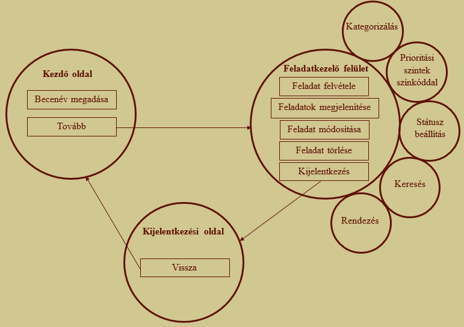
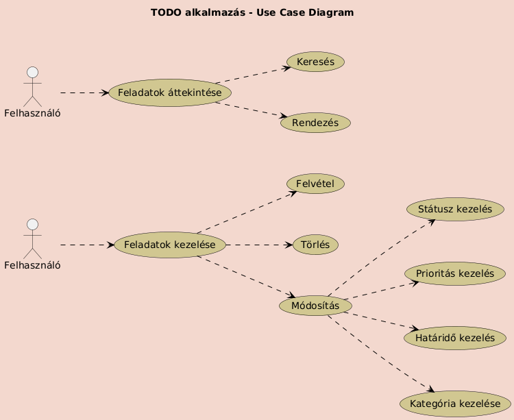
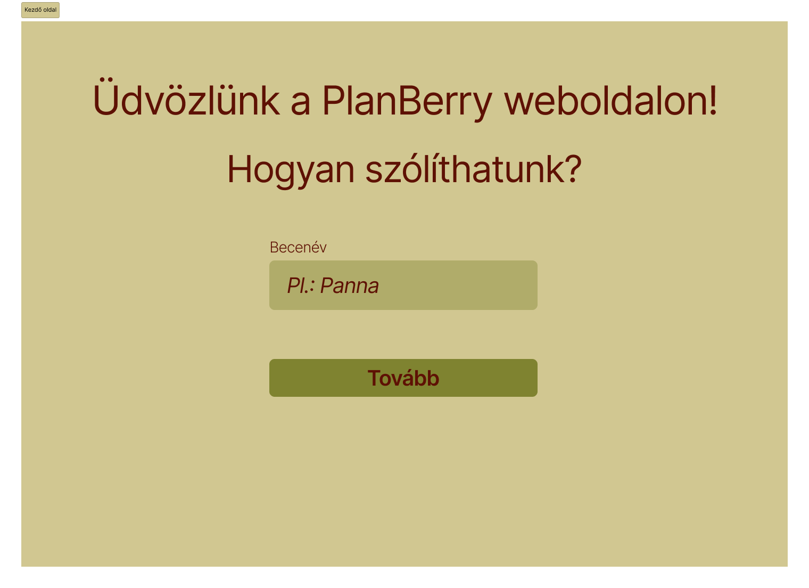
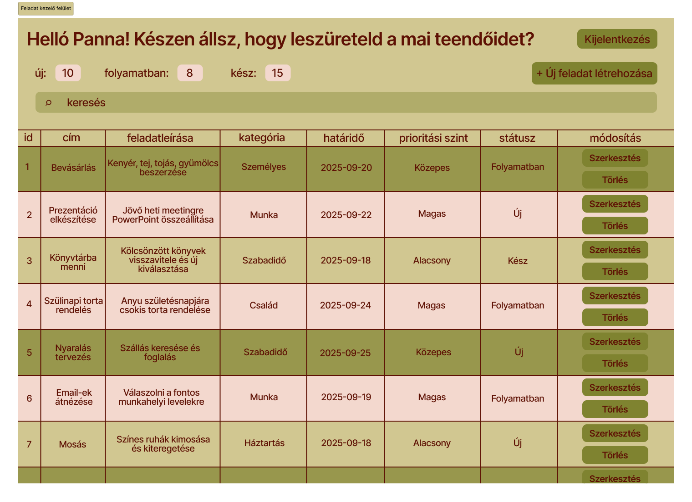
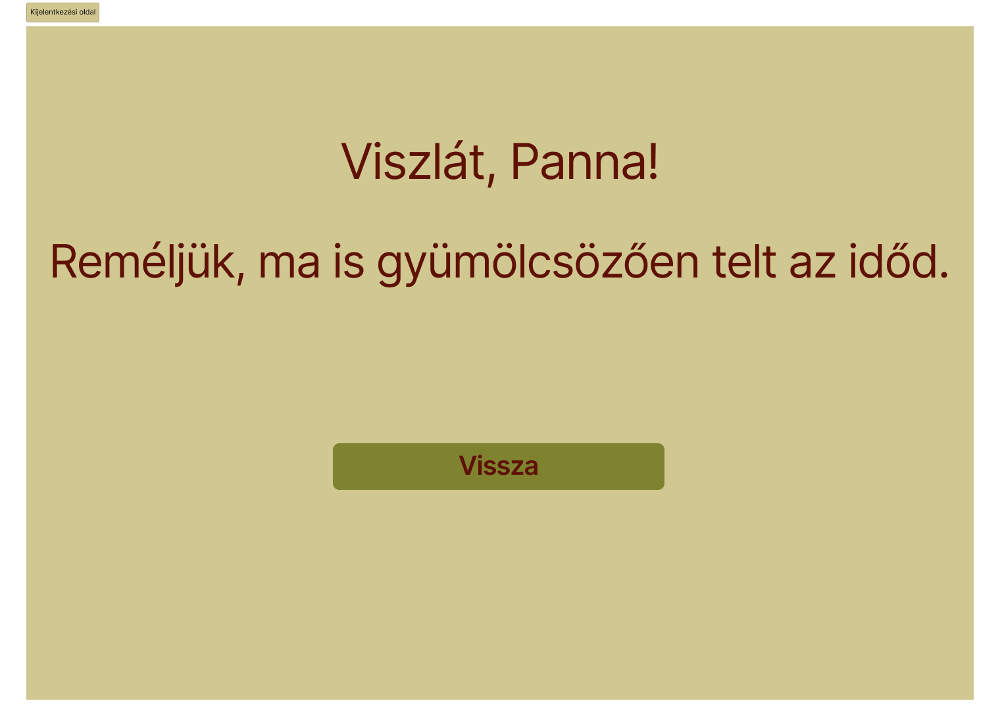

# Funkcionális specifikáció

## 1. A rendszer céljai és nem céljai

### 1.1 A rendszer céljai

Az elkészített rendszerrel a felhasználó képes lesz:

* feladatait egy helyen, átláthatóan nyomonkövetni, felesleges szemét *(cetlik)* generálása nélkül
* új feladatokat hozzáadni, módosítani a már létrehozottakat
* kategorizálni a feladatokat
* megadni a feladatok fontosságát *(prioritás)*
* törölni, ha esetleg rosszul adott meg valamit
* határidő megadása *(deadline)*
* feldatokat rendezni
* feladatok közötti keresésni
* a fentebb felsoroltakat akármilyen internethasználatra alkalmas eszközön végrehajtani

### 1.2 A rendszer ***NEM*** céljai

Az elkészített rendszerrel a felhasználó ***NEM*** lesz képes:

* több felhasználó adatait külön-külön kezelni *(böngészőnként tároljuk az adatokat)*
* egyszerre több kategóriába sorolni egy feladatot
* ugyan azon adatokat elérni különböző eszközökről
* több másik felhasználóval ugyan azokat a feladatokat kezelni

## 2. Jelenlegi helyzet

Az embereknek mindennapjaik során számos feladatot kell, hogy elvégezzenek. Mind a munka, a tanulás és a magánélet kapcsán felmerülnek fontos határidők, elvégzendő teendők. Ezeket sokan rendszertelenül tartjuk számon: egyes teendőket cetlikre írunk fel, másokat a telefonba jegyzünk fel, néhányat pedig csak próbálunk fejben tartani.

Ez nem a legoptimálisabb, hiszen így könnyen feledésbe merülhetnek fontos dolgok, a papírra felírt információk akár el is veszhetnek. Ezen felül sürgető határidők mellett nehéz meghatározni, hogy melyik teendővel kezdjünk, melyiket lenne a legfontosabb megcsinálni. Valamint nem mindig egyértelmű, hogy egy adott feladat elvégzése elkezdődött-e már, vagy befejeződött. Emellett az is előfordul, hogy emlékszünk egy feladatra, de nem találjuk, hová jegyeztük fel.

Ezek miatt a feladatok kezelése sokszor átláthatatlan és stresszes. Egy egységes rendszer, amely támogatja a feladatok rögzítését, fontossági sorrend szerinti kategorizálását és kereshetőségét, nagymértékben megkönnyítené a mindennapokat.

## 3. Vágyálom rendszer

## 4. Jelenlegi üzleti folyamatok

**A feladatok kezelésének jelenlegi folyamata:**

1. **Feladat megjelenése:** Egy új teendő felmerül.
2. **Feladat feljegyzése:** A feladatot különböző módon próbáljuk megjegyezni: cetlire írás/telefonba feljegyzés/fejben tartás.
3. **Feladat prioritásának meghatározása:** A prioritások meghatározására nincs egységes rendszer. Általában azzal kezdünk, amit fontosabbnak érzünk, emiatt előfordulhat, hogy fontos feladatok háttérbe szorulnak vagy teljesen elfelejtődnek.
4. **Feladat állapotának nyomon követése:** A feladatok állapota *(pl. új / folyamatban / kész)* nincs rögzítve.
5. **Feladat teljesítése:** A feladatokat nem feltétlenül sikerül teljesíteni, mert előfordulhat, hogy elfelejtjük, vagy elhagyjuk a cetlit, vagy túl későn találjuk meg a feljegyzést.

A folyamat széttagolt, hiányzik belőle a rendszerezettség, így könnyen átláthatatlanná válik.

## 5. Igényelt üzleti folyamatok

### 5.1 Igényelt üzleti folyamatok leírása
A megrendelő azt szeretné, hogy a felhasználóknak a **kezdő oldalon** csak egy **becenevet** kelljen **megadnia**, amelyet a rendszer a későbbiekben a megszólítás során használ. A kezdő oldalról egy **tovább gombbal** lehessen továbblépni a feladatkezelő felületre.

A **feladatkezelő felületen** a felhasználók **láthassák a meglévő feladataikat**, ezeket tudják **módosítani** és **törölni**, valamint legyen lehetőségük **új feladatokat létrehozni**. A megrendelő igénye, hogy a feladatokhoz **kategóriát**, **prioritást** és **státuszt** lehessen hozzárendelni, illetve ezeket később módosítani is lehessen. További elvárás, hogy a feladatok között könnyű legyen eligazodni, ezért a rendszer biztosítson **keresési és rendezési lehetőségeket**.

A feladatkezelő felületről **kijelentkezés** gombbal lehessen kijelentkezni, amely egy **kijelentkezési oldalra** vezet, ahonnan **vissza** lehet térni a kezdő oldalra.

### 5.2 Igényelt üzleti folyamatok diagram

## 7. Használati esetek

### 7.1 Aktorok (szereplők) meghatározása

Esetünkben az egyetlen szereplő maga a ***felhasználó***.

### 7.2 Használati eset diagram

## 8. Követelménylista

|Modul        | ID |Név                    | v.|Kifejtés                              |
|-------------|----|-----------------------|---|--------------------------------------|
| Jogosultság | K1 | Bejelentkezési felület | 1.0 | A felhasználónak kötelező megadnia egy becenevet, amelyet a program a továbbiakban a megszólítás során használ. |
| Felület | K2 | Kezdőlap | 1.0 | A felhasználó itt adja meg a becenevét. Sikeres megadás után egy másik oldalra léphet tovább, ahol a feladatait kezelheti.|
| Felület | K3| Feladatkezelő felület | 1.0 | A felhasználó itt hozhat létre, módosíthat és törölhet feladatokat. A feladatok Bootstrap modal ablakokban szerkeszthetők, így a megjelenés áttekinthetőbb. |
| Feladattípus | K4 | Feladat hozzáadása | 1.0 | Új feladat létrehozása cím, leírás, határidő és prioritás *(low, medium, high)* megadásával. A prioritás színekkel is jelölve van.|
| Feladattípus | K5 | Feladat módosítása | 1.0 | A felhasználó szerkesztheti egy meglévő feladat adatait |
| Feladattípus | K6 | Feladat törlése | 1.0 |Egy feladat véglegesen törölhető a listából. |
| Feladattípus | K7 | Feladat státusz módosítása | 1.0 |A felhasználó átállíthatja a feladat állapotát *(pl.  új / folyamatban / kész)*. |
| Felület | K8 | Keresés és rendezés | 1.0 |A felhasználó kereshet feladatok között, és rendezheti azokat. |
| Adatkezelés | K9 | Tárolás | 1.0 |Az alkalmazás minden adatot *(becenév, feladatok)* eltárol a böngésző által biztosított tárolóban *(localStorage)*|

## 9. Képernyőtervek

### 9.1 Kezdő oldal

### 9.2 Feladat kezelő felület

### 9.3 Kijelentkezési oldal

## 10. Forgatókönyvek

