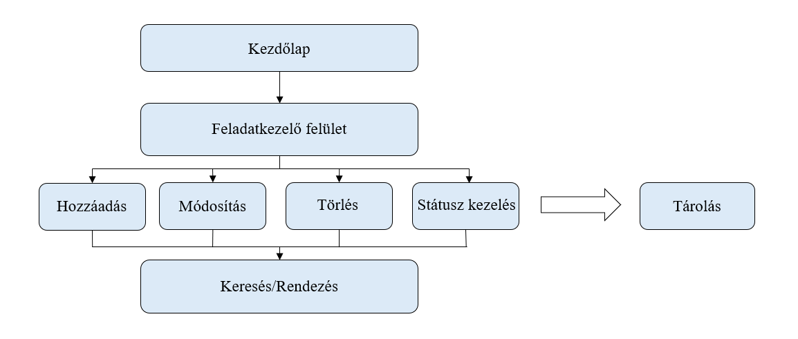

# TODO feladatkezelő rendszer

## 5. A rendszerre vonatkozó szabályok

- Standard webes technológiák *(HTML / CSS / JS)* alkalmazása.
- Könnyen üzemeltethető és karbantartható rendszer.
- Reszponzív design, amely minden eszközön *(mobil, tablet, PC)* jól működik.
- Egyszerű és intuitív felhasználói felület kialakítása.

## 7. Igényelt üzleti folyamatok

A felhasználónak a kezdő *bejelentkező* oldalon csak egy becenevet kell megadnia, amelyet a program a továbbiakban a megszólítás során fog használni. A bejelentkezést követően a felhasználó a feladatkezelő felületre érkezik, ahol igényeinek megfelelő feladatokat tud felvenni, a meglévőket módosítani, illetve igény szerint törölni. Ezeken a funkciókon felül lehetősége van a feladatok státuszát állítani annak megfelelően, hogyan áll azok teljesítésével. A felvett elemek között kereshet, valamint rendezheti azokat.

## 8. Követelménylista

|Modul        | ID |Név                    | v.|Kifejtés                              |
|-------------|----|-----------------------|---|--------------------------------------|
| Jogosultság | K1 | Bejelentkezési felület | 1.0 | A felhasználónak kötelező megadnia egy becenevet, amelyet a program a továbbiakban a megszólítás során használ. |
| Felület | K2 | Kezdőlap | 1.0 | A felhasználó itt adja meg a becenevét. Sikeres megadás után egy másik oldalra léphet tovább, ahol a feladatait kezelheti.|
| Felület | K3| Feladatkezelő felület | 1.0 | A felhasználó itt hozhat létre, módosíthat és törölhet feladatokat. A feladatok Bootstrap modal ablakokban szerkeszthetők, így a megjelenés áttekinthetőbb. |
| Feladattípus | K4 | Feladat hozzáadása | 1.0 | Új feladat létrehozása cím, leírás, határidő és prioritás *(low, medium, high)* megadásával. A prioritás színekkel is jelölve van.|
| Feladattípus | K5 | Feladat módosítása | 1.0 | A felhasználó szerkesztheti egy meglévő feladat adatait |
| Feladattípus | K6 | Feladat törlése | 1.0 |Egy feladat véglegesen törölhető a listából. |
| Feladattípus | K7 | Feladat státusz módosítása | 1.0 |A felhasználó átállíthatja a feladat állapotát *(pl.  új / folyamatban / kész)*. |
| Felület | K8 | Keresés és rendezés | 1.0 |A felhasználó kereshet feladatok között, és rendezheti azokat. |
| Adatkezelés | K9 | Tárolás | 1.0 |Az alkalmazás minden adatot *(becenév, feladatok)* eltárol a böngésző által biztosított tárolóban *(localStorage)*|

## 8.1 Rendszer áttekintés

## 9. Fogalomtár

|Fogalom        | Meghatározás |
|-------------|----|
| Reszponzív felület | A webalkalmazás mobilon, tableten és PC-n egyaránt megfelelően jelenik meg, a képernyőmérethez igazodva. |
| CRUD műveletek | Create, Read, Update, Delete, azaz létrehozás, lekérdezés, módosítás és törlés. |
| Prioritási szint |A feladat fontosságát jelző kategória |
| Státusz | A feladat aktuális állapota |  
| LocalStorage | A böngésző által biztosított kliens oldali tároló, ahol az adatok megőrződnek az oldalfrissítés után is. |
| Modal ablak | Felugró ablak a felületen, ami a fő tartalmat nem takarja el teljesen, pl. feladat szerkesztésére.|