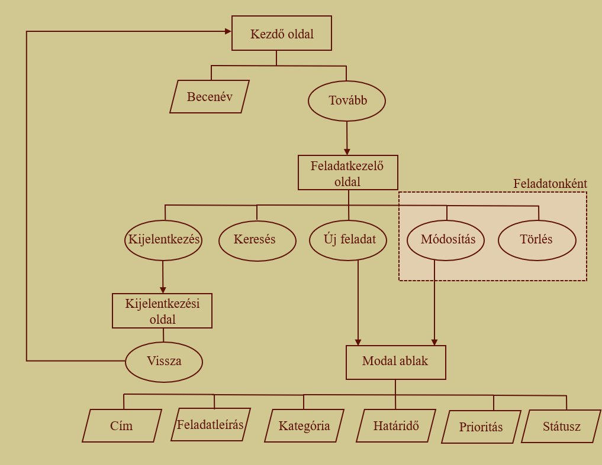
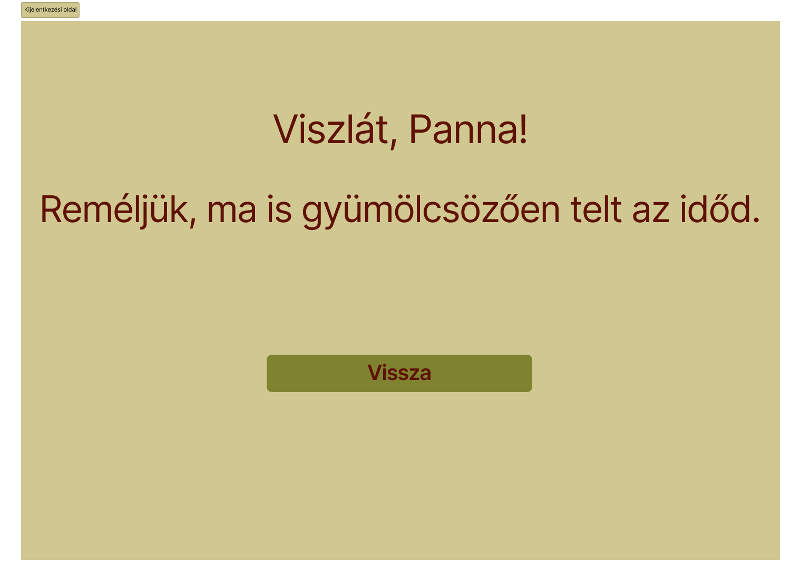
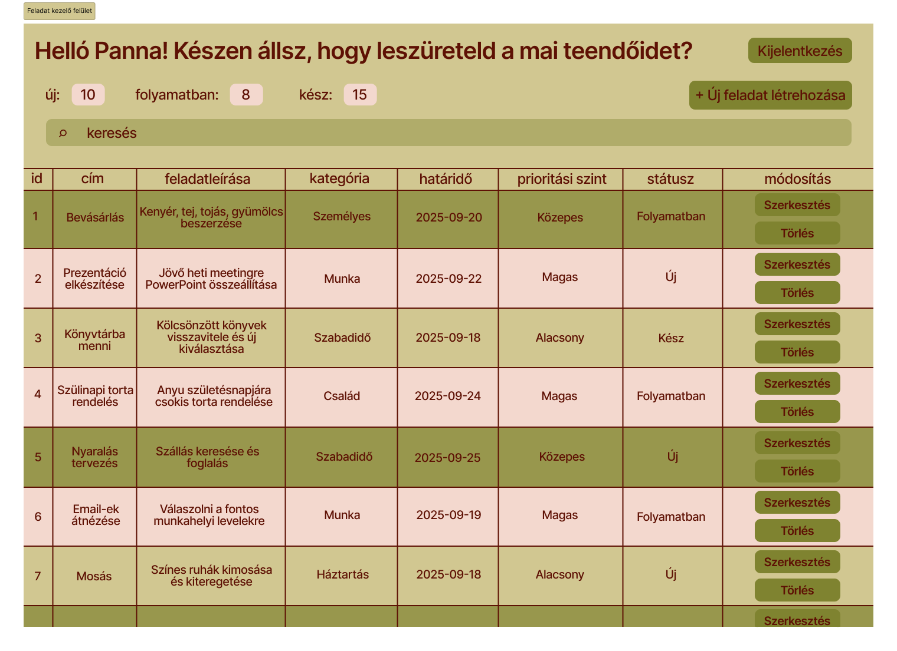
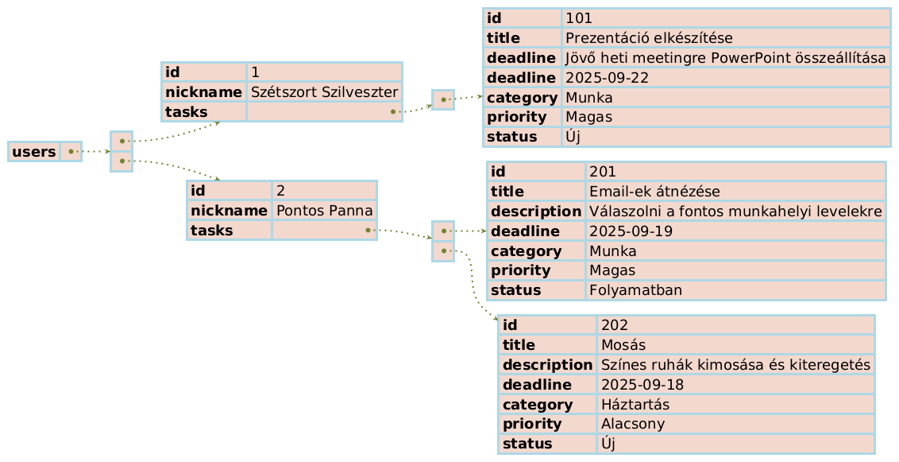
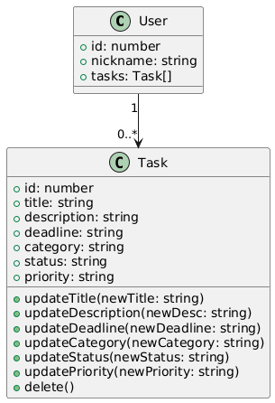

# Rendszerspecifikáció

## 1. A rendszer célja

A mindennapi életben számtalan teendőnk akad, amelyeket sokszor rendszertelenül próbálunk követni: egyes feladatokat cetlikre írunk, másokat a telefonba jegyzünk fel, néhányat pedig csak próbálunk fejben tartani. Ezek azonban könnyen elveszhetnek, átláthatatlanná válhatnak, és előfordulhat, hogy fontos dolgok feledésbe merülnek. A rendszerünk célja, hogy egy átlátható, egyszerűen kezelhető felületet biztosítson a felhasználóknak, ahol felvehetik, nyomon követhetik, módosíthatják és törölhetik teendőiket. A rendszer lehetőséget nyújt kategóriák, prioritások és határidők megadására, így mindenki a saját igényei szerint rendszerezheti feladatait. A keresési és rendezési funkciók segítségével a felhasználók könnyedén eligazodhatnak a feladatok között. Továbbá a prioritásokhoz különböző színkódok tartoznak, amelyek még áttekinthetőbbé teszik a felületet. Az alkalmazás webes felületen érhető el reszponzív kialakítással, így számítógépről, tabletről és mobilról egyaránt kényelmesen használható.

## 2. Projektterv

### 2.1  Projektszerepkörök, felelősségek

* **PM** (Project Manager): Az a személy, aki a projekt vezeti. Ez a személy végzi a projekt felülvizsgálatát, mind részfeladatok meghatározása, mind változtatások bekerülése terén.
* **UI/UX Designer**: Felhasználóbarát és átlátható felület tervezése. Színek, ikonok, tipográfia, reszponzív elrendezés meghatározása
* **PA** (Program Analyst): Tervezésért, fejlesztésért felelős személy. Optimális megoldások kifejlesztésére is hivatott. Programkódok írása.
* **QA** (Quality Assurance): Teszteket biztosít a projekthez, amik a kód helyes működést támasztják alá.

### 2.2 Projektmunkások és felelősségeik

* **Varga Tímea**: *PM, PA*
* **Szőllős Boglárka**: *UI/UX Designer, PA*
* **Kántor Kamilla**: *QA, PA*

### 2.3 Ütemterv

**Ütemterv:**

| Funkció / Story                | Feladat / Task                                           | Prioritás | Becsült szükséges idő (óra) | Ráfordított idő (óra) |
|--------------------------------|---------------------------------------------------------|-----------|----------------------------|----------------------|
| Követelmény specifikáció       | Követelmények összegyűjtése, dokumentáció elkészítése  | 1         | 6                        | 4                  |
| Funkcionális specifikáció      | Funkciók, use-case-ek, felhasználói történetek kidolgozása | 1      | 6                         | 5                   |
| Rendszerterv                   | Adatmodell, architektúra, menü-hierarchia, képernyőtervek készítése | 1 | 6 | 0 |
| Szerveroldal létrehozása       | localStorage alapú adatkezelés, CRUD függvények implementálása JavaScript-tel | 2 | 12 | 0 |
| Kinézet létrehozása             | Frontend fejlesztés, HTML/CSS, reszponzív felület, modal ablakok | 2 | 12 | 0 |
| Tesztek megírása és futtatása  | Funkcionális teszt, reszponzív teszt, hibajavítás     | 3         | 4                         | 0                   |

## 3. Üzleti folyamatok modellje

### 3.1 Üzleti szereplők
* **Felhasználó**: a rendszert használja
* **Rendszer**: a felhasználó műveleteit kezeli, adatokat tárol és jelenít meg
* **Megrendelő**: igényeket határoz meg

### 3.2 Üzleti folyamatok
1. **Becenév megadása**
    * A felhasználó megadja a becenevét
    * Rendszer eltárolja a becenevet
2. **„Tovább” gomb megnyomása**
    * Feladatkezelőre irányít
3. **Feladatok kezelése**
    * Feladatok listázása
    * Új feladat létrehozása
    * Meglévő feladat módosítása és törlése
    * Keresés és rendezés a feladatok között
4. **Kijelentkezés gomb megnyomása**
    * Felhasználó kijelentkezik
    * Kijelentkezési oldalra irányít
5. **„Vissza” gomb megnyomása**
    * Kezdő oldalra irányít

### 3.3 Üzleti entitások
* **Becenév**: a felhasználó azonosítására szolgál
* **Feladat**: központi entitás, amit a felhasználó kezelhet
    * attribútumai: *id*, *cím*, *feladatleírás*, *kategória*, *határidő*, *prioritás*, *státusz*

## 4. Követelmények

### 4.2 Nemfunkcionális követelmények
- **Teljesítmény**
	- Az alkalmazás oldalainak betöltési ideje átlagos hálózati körülmények között legfeljebb 2 másodperc.
	- A felhasználói műveletekre (feladat létrehozás, módosítás, törlés) a rendszernek 1 másodpercen belül kell reagálnia.
- **Megbízhatóság és rendelkezésre állás**
	- Az alkalmazás böngészőfüggetlenül működik: támogatott böngészők: Chrome, Firefox, Edge, Opera.
	- A localStorage-ben tárolt adatok nem veszhetnek el oldalfrissítés vagy böngésző újranyitás után.
- **Biztonság**
	- A felhasználói adatokhoz csak az adott felhasználó férhet hozzá a saját böngészőjén belül.
- **Felhasználhatóság**
	- A felület reszponzív kialakítású, így mobilon, tableten és asztali gépen egyaránt kényelmesen használható.
	- A felhasználói felület **magyar nyelvű** és konzisztens elnevezéseket használ.
- **Karbantarthatóság és bővíthetőség**
	- A forráskód **moduláris felépítésű**, így könnyen bővíthető új funkciókkal.
	- Verziókövetésre GitHub használatos, minden módosítás commitokban és branchekben követhető.
	- A dokumentáció naprakész, a fejlesztők számára egyértelmű iránymutatást ad.

## 5. Funkcionális terv

### 5.1 Rendszerszereplők
Esetünkben az egyetlen rendszerszereplő maga a ***felhasználó***.

### 5.2 Rendszerhasználati esetek és lefutásaik
1. Bejelentkezés (becenévvel)
    * Lefutás: Kezdő oldal → üzenet + becenév megadása (nincs jelszó) + „Tovább” gomb → Feladatkezelő oldal

2. Új feladat létrehozása
    * Lefutás: „Új feladat” gomb → modal ablak → adatok kitöltése (cím, leírás, kategória, határidő, prioritás, státusz) → feladat megjelenik a listában

3. Feladat módosítása
    * Lefutás: Feladat melletti „Módosítás” gomb → modal ablak → mezők módosítása (cím, leírás, kategória, határidő, prioritás, státusz) → feladat módosul

4. Feladat törlése
    * Lefutás: Feladat melletti „Törlés” gomb → törlés megerősítése → feladat eltűnik a listából

5. Feladatok keresése
    * Lefutás: Keresőmezőbe beírás → szűrt lista jelenik meg

6. Kijelentkezés
    * Lefutás: „Kijelentkezés” gomb → Kijelentkezési oldal → üzenet + „Vissza” gomb → Kezdő oldal

### 5.3 Határosztályok
* **Kezdő oldal**
    * Üdvözlő üzenet
    * Becenév input mező
    * „Tovább” gomb
* **Feladatkezelő oldal**
    * Üdvözlő üzenet
    * Feladatok listája
        * (*Feladatonként ismétlődő elemek*) „Módosítás” és „Törlés” gomb
    * Feladatok státusz szerinti összefoglaló (Új / Folyamatban / Kész számlálóval)
    * „Új feladat” gomb
    * Keresés mező
    * „Kijelentkezés” gomb
* **Modal ablak**
    * Cím input mező
    * Feladatleírás input mező
    * Kategória input mező
    * Határidő input mező
    * Prioritás input mező
    * Státusz input mező
* **Kijelentkezési oldal**
    * Elköszönő üzenet
    * „Vissza” gomb

### 5.4  Menü-hierarchiák



### 5.5 Képernyőtervek
### Kezdő oldal


### Feladatkezelő oldal


### Kijelentkezési oldal


## 6. Fizikai környezet

Az alkalmazás webes felületre készül, reszponzív kialakítással, így mobil eszközökön is kényelmesen használható. A hálózaton tűzfal üzemel, de minden szükséges port engedélyezett a működéshez. A projekthez nem tartoznak megvásárolt komponensek vagy fizetős szoftverek.

### 6.1 Fejlesztő eszközök

| Eszköz / Szoftver               | Rendeltetés                                           | Megjegyzés                                                                                                                        |
|---------------------------------|-------------------------------------------------------|-----------------------------------------------------------------------------------------------------------------------------------|
| Visual Studio Code              | Fejlesztői környezet (IDE)                            |                                                                                                                                   |
| JetBrains WebStorm              | Fejlesztői környezet (IDE)                            |                                                                                                                                   |
| HTML5                           | Weboldalak struktúrájának kialakítása                 | Az oldal vázát adja, minden frontend fejlesztés alapja                                                                            |
| CSS3                            | Stílusok kezelése                                     |                                                                                                                                   |
| Bootstrap                       | Frontend-fejlesztési keretrendszer                    | Előre elkészített komponensek és rácsrendszer a reszponzív designhoz                                                              |
| Vanilla JavaScript              | Dinamikus funkciók, eseménykezelés, DOM manipuláció   |                                                                                                                                   |
| LocalStorage                    | Adattárolás a kliens oldalon                          | Egyszerű key-value tárolás a felhasználói adatokhoz; böngésző által biztosított                                                   |
| Chrome / Firefox / Edge / Opera | Funkcionális tesztelés, reszponzív teszt, hibakeresés | Fejlesztői eszközök (DevTools) használatával kódprofilozás, hibakeresés és performance teszt                                      |
| Git/GitHub                      | Verziókezelés, kódmegosztás, csapatmunka              | Commit-ok, branch-ek és pull request-ek kezelése, projektek nyomon követése                                                       |
| Trello                          | Projekt- és feladatmenedzsment                        | Kanban tábla a sprintek és taskok vizuális követéséhez, prioritások kezelése, agile tool-ok használata (story points, wip number) |

## 8. Adatmodell terv

A rendszer **adatbázis helyett a böngésző által biztosított localStorage-t** használja az adatok tárolására. A localStorage **kulcs-érték párok**at tárol, melyek JSON formátumban szervezhetők, így a felhasználói adatok és a feladatok megőrizhetők az oldalfrissítés után is.

``` json
{
  "users": [
    {
      "id": number,
      "nickname": string,
      "tasks": [
        {
          "id": number,
          "title": string,
          "description": string,
          "category": string,
          "deadline": string,
          "priority": string,
          "status": string
          
        }
      ]
    }
  ]
}
```
### 8.1 Mezők jelentése

* `users`: a felhasználókat tartalmazó tömb.
  * `id`: a felhasználó egyedi azonosítója.
  * `nickname`: a felhasználó által megadott becenév, amely megszólításra szolgál.
  * `tasks`: a felhasználóhoz tartozó feladatok listája.
    * `id`: a feladat egyedi azonosítója.
    * `title`: rövid cím, ami a feladatot összefoglalja.
    * `description`: részletesebb leírás a feladatról.
    * `category`: a feladat kategóriája *(pl. „Tanulás”, „Munka”)*.
    * `deadline`: határidő, ISO 8601 dátum stringként tárolva.
    * `priority`: a feladat fontossága *(pl. „alacsony”, „közepes”, „magas”)*.
    * `status`: a feladat állapota *(pl. „új”, „folyamatban”, „kész”)*.

### 8.2  **Minta**



### 8.3 Osztálydiagram

Az alábbi osztálydiagram szemlélteti azokat a logikai kapcsolatokat, amelyek a felhasználók és a feladataik között fennállnak. A diagram segítségével vizuálisan is átlátható, hogyan épül fel a JSON-alapú adatstruktúra.


- A **User** entitás rendelkezik egyedi azonosítóval és becenévvel.
- Minden felhasználóhoz tartozhat **0 vagy több Task** (feladat).
- A **Task** entitás a feladatok adatait tartalmazza: cím, leírás, kategória, határidő, prioritás és státusz.
- A diagramon szereplő metódusok (_updateTitle()_, _delete()_ stb.) szemléltetik, milyen műveletek végezhetők el az adatokon, de ezek nem jelennek meg tényleges objektumorientált metódusként, hanem a rendszer funkcionális működését írják le.

## 10. Tesztterv

### 10.1 Tesztelés célja
A tesztelés célja, hogy biztosítsa az alkalmazás funkciói a specifikációnak megfelelően működjenek, a felhasználói élmény maximális legyen, a folyamatok gördülékenyek legyenek, és a rendszer teljesítse a funkcionális és nemfunkcionális követelményeket.

### 10.2 Tesztelési környezet
- **Platformok**: Windows, macOS, Android, iOS
	- modern böngészők: Chrome, Firefox, Edge, Opera
- **Tárolás**: localStorage
- **Tesztelési eszközök**
	- böngésző DevTools
	- manuális tesztelés

### 10.3 Tesztelési típusok
- **Funkcionális teszt** - CRUD műveletek *(létrehozás, módosítás, törlés)*
- **UI/UX teszt** - gombok, navigáció, reszponzivitás
- **Nemfunkcionális teszt** - teljesítmény *(pl. betöltési idő)*, biztonság *(input validálás)*
- **Kompatibilitási teszt** - több böngésző és eszköz

### 10.4 Tesztesetek

| Azonosító | Tesztleírás             | Lépések                                                                                      | Elvárt eredmény                                                                                                               |
| --------- | ----------------------- | -------------------------------------------------------------------------------------------- | ----------------------------------------------------------------------------------------------------------------------------- |
| T-01      | Bejelentkezés           | 1. Név megadása<br>2. *Tovább* gomb                                                          | Betöltődik a feladatokat megjelenítő oldal, ahol a rendszer a megadott becenevet használja a felhasználóra való hivatkozáskor |
| T-02      | Kijelentkezés           | 1. *Kijelentkezés* gomb                                                                      | Betöltődik a kijelentkezést jelző oldal                                                                                       |
| T-03      | Feladat létrehozása     | 1. *Új feladat létrehozása* gomb<br>2. Cím és leírás megadása<br>3. *Mentés* gomb            | A feladat megjelenik a listában az összes megadott adattal.                                                                   |
| T-04      | Feladat szerkesztése    | 1. Meglévő feladat szerkesztése: *Szerkesztés* gomb<br>2. Cím módosítása<br>3. *Mentés* gomb | A feladat címe frissül a listában.                                                                                            |
| T-05      | Feladat törlése         | 1. Meglévő feladat törlése: *Törlés* gomb<br>2. *Megerősítés* gomb                           | A feladat eltűnik a listából, többé nem érhető el.                                                                            |
| T-06      | Keresés funkció         | 1. Keresőmezőbe írni a feladat címét                                                         | Csak a keresési feltételnek megfelelő feladatok jelennek meg.                                                                 |
| T-07      | Részletek megjelenítése | 1. Kattintás a feladatmezőre                                                                 | Részletek megjelenése modal ablakban, miközben a lista látható marad                                                          |
| T-08      | Reszponzív megjelenés   | 1. Alkalmazás megnyitása mobilon/tableten/PC-n                                               | Az UI alkalmazkodik a képernyő méretéhez, minden elem jól olvasható és elérhető.                                              |

## 11. Telepítési terv
### 11.1 Telepítési környezet
- **Célplatform:** webböngésző *(Chrome, Firefox, Edge, Opera)*
- **Futtatási követelmények:** internetkapcsolat
- **Kliensoldali tárolás:** localStorage
- **Operációs rendszer:** platformfüggetlen *(Windows, macOS, Linux, Android, iOS)*

### 11.2 Előkészületek
- A felhasználónak rendelkeznie kell legalább egy támogatott böngészővel.
- Internetkapcsolat szükséges a projektfájlok első letöltéséhez.
- A letöltött projekt ZIP fájlát ki kell csomagolni a számítógépen egy tetszőleges mappába.
- A mappában található `index.html` fájl biztosítja az alkalmazás indítását.

### 11.3 Telepítési lépések
- Nyisd meg a projekt GitHub oldalát, és töltsd le a forráskódot ZIP fájlként.
- Csomagold ki a letöltött ZIP fájlt egy általad választott helyre.
- Keresd meg a kicsomagolt mappában az **`index.html`** fájlt.
- Dupla kattintással nyisd meg az `index.html` fájlt a böngésződben.
- A kezdőképernyőn add meg a becenevedet, majd kattints a *Tovább* gombra – ezzel az alkalmazás telepítése és indítása megtörtént.

## 12. Karbantartási terv

Az alkalmazás folyamatos és megbízható működésének biztosítása érdekében szükséges a rendszer rendszeres és megfelelő karbantartása. Mivel az adatok a böngésző LocalStorage területén tárolódnak, nincs szükség külön szerver- vagy adatbázis-karbantartásra. Azonban továbbra is figyelmet kell fordítani a hibák kijavítására, a felhasználói élmény javítására és a webes technológiák fejlődéséből adódó lehetőségek integrálására. Emelett az új felhasználói igényeket is ki kell elégíteni, új funkciók beépítésével.

| Karbantartás típusa | Karbantartási tevékenység a rendszerben |
|----------------------|-------------------------|
| **Corrective Maintenance** (Hibajavító) | A felhasználók által jelzett hibák kijavítása. |
| **Adaptive Maintenance** (Alkalmazkodó) | Az alkalmazás kompatibilitásának fenntartása különböző böngészők és verziók között. A felület naprakészen tartása a webes szabványok változásainak megfelelően. |
| **Perfective Maintenance** (Tökéletesítő) | Új funkciók bevezetése. Felhasználói élmény javítása. |
| **Preventive Maintenance** (Megelőző) | Kódellenőrzés és refaktorálás. Biztonsági szempontok ellenőrzése. |